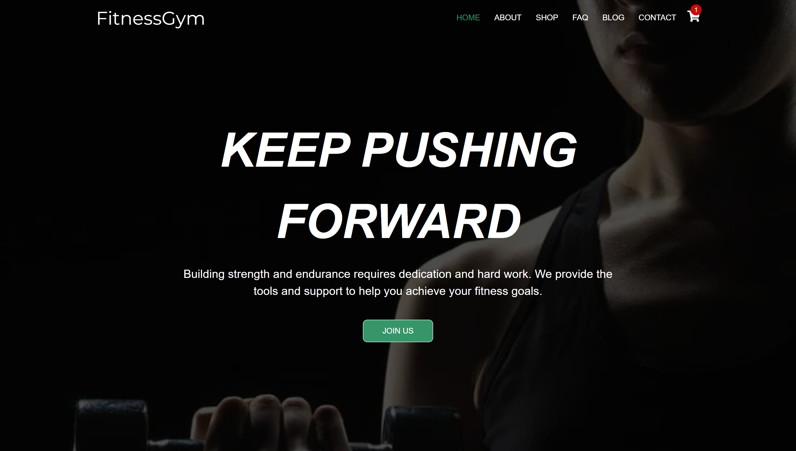

# hydra gym -Website

> 🚀 **Modern Fitness Website with React** - Build dynamic fitness platforms with interactive features and responsive design

## 📋 Description

Welcome to the **hydra gym -Web-App** repository! This project showcases a modern and fully responsive fitness website built with React, offering dynamic features such as a product shop, trainer profiles, gym services, and interactive schedules. The platform delivers an engaging experience for fitness enthusiasts with cutting-edge frontend technologies.

This repository demonstrates best practices in React development, component-based architecture, and modern web design patterns for fitness and wellness platforms.

## 📁 Repository Structure

```
hydra gym -Website/
├── 📁 public/           # Static public files and assets
├── 📁 src/
│   ├── 🖼️ assets/       # Images, media, and graphic resources
│   ├── ⚛️ components/   # Reusable React components
│   ├── 📄 pages/        # Main page components (Home, Shop, Trainers)
│   ├── 🎨 styles/       # Global and modular SCSS styles
│   └── 💻 App.js        # Main application entry point
├── 📦 package.json      # Project dependencies and metadata
└── 📖 README.md         # Project documentation
```

## 🚀 Getting Started

### 1. Clone the Repository

```bash
git clone https://github.com/chapi1234/hydra gym -Web-App.git
cd hydra gym -Web-App
```

### 2. Install Dependencies

```bash
npm install
```

### 3. Start Development Server

```bash
npm start
```

- Open your browser and navigate to [http://localhost:3000](http://localhost:3000)

## ⚙️ System Requirements

### **Essential Tools:**

- **Node.js** (version 14.0 or higher)
- **npm** or **yarn** package manager
- **Modern Web Browser** (Chrome, Firefox, Safari, Edge)
- **Git** for version control

### **Development Environment:**

- **Code Editor** (VS Code, WebStorm, Sublime Text)
- **React Developer Tools** browser extension
- **Node.js debugging tools**

### **Recommended Extensions:**

- **ES6/React** syntax highlighting
- **Sass/SCSS** support
- **Prettier** for code formatting
- **ESLint** for code quality
- **Auto Rename Tag** for JSX editing

### **React Ecosystem:**

- **React** (latest version)
- **React DOM** for rendering
- **React Scripts** for build configuration
- **SCSS/SASS** for styling

## ✨ Key Features

### **🛒 Interactive Product Shop**

- Browse fitness supplements: proteins, creatine, pre-workouts
- Detailed product descriptions with pricing and high-quality images
- Dynamic shopping cart functionality with add/remove capabilities

### **🏋️ Gym Services Section**

- Comprehensive gym facilities and available classes
- Interactive schedules and booking system
- Trainer profiles showcasing specialties and certifications

### **📱 Responsive Design**

- Flawless experience across mobile, tablet, and desktop devices
- Modern React responsive patterns and CSS Grid/Flexbox

### **⚡ Dynamic Frontend**

- Advanced search functionality and product category filtering
- Interactive UI components with smooth animations
- Real-time state management for cart and user interactions

### **🎨 Modular Architecture**

- Component-based React structure for scalability
- Clean, reusable SCSS/SASS styling system
- Organized file structure following React best practices

## 🛠️ Technologies Used

- **React** - Component-based frontend framework
- **JavaScript (ES6+)** - Modern JavaScript features and logic
- **SCSS/SASS** - Advanced CSS preprocessing and styling
- **Git** - Version control and collaboration
- **NPM** - Package management and dependency handling

## 🌍 Live Demo

The project is deployed and available at: **[https://fitnesgym.vercel.app](https://fitnesgym.vercel.app)**

## 🖼️ Preview

[](src/assets/fitnessgym.dawidolko.pl_.png)

## 🤝 Contributing

Contributions are highly welcomed! Here's how you can help:

- 🐛 **Report bugs** - Found an issue? Let us know!
- 💡 **Suggest improvements** - Have ideas for better features?
- 🔧 **Submit pull requests** - Share your enhancements and solutions
- 📖 **Improve documentation** - Help make the project clearer

Feel free to open issues or reach out through GitHub for any questions or suggestions.

## 👨‍💻 Author

Created by **Metasebiyaw Asfaw** - Part of the **hydra gym ** project series.

## 📄 License

This project is open source and available under the [MIT License](LICENSE).

---

⭐ **Found this helpful?** Give it a star and share with fellow React developers!
